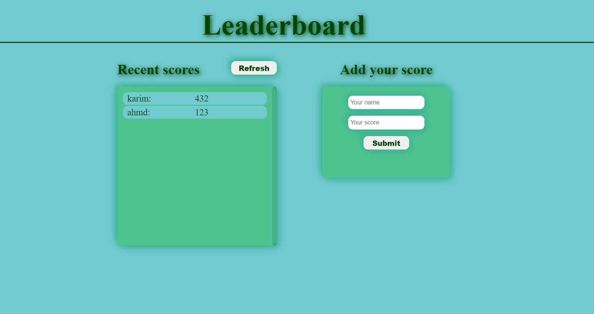

# Leaderboard

> The leaderboard website displays scores submitted by different players. It also allows you to submit your score.

Below you can see how this website should look and behave:


## Live Demo

[Live Demo](https://sediqullahbadakhsh.github.io/leaderboard/)

### Interaction with the Leaderboard API

- First, add the base url
- Create a new game. The POST method is used to create a new game and the game must have a name e.g { "name": "My cool new game" } Each created game has a result in the form of a unique ID or key called the gameId
- There are two allowed actions to access the scores, the POST and GET methods
- POST method creates a new score for the given game and it requires that a username and point is first given
- GET method however does not require any input from the user and its function is just to return the list of users and their scores
- Get the gameID then chain it with the base url to get the score.

#### more Information can be found on [Leaderboard API Docmention](https://www.notion.so/Leaderboard-API-service-24c0c3c116974ac49488d4eb0267ade3)

## Setup

### Clone this repository

```bash
$ git clone git@github.com:sediqullahbadakhsh/Leaderboard.git
$ cd Leaderboard
```

### Run project

```bash
$ npm install
$ npm run start # this will make webpack watching for your changes in code
```

### Open page in browser

```bash
$ open dist/index.html
```

## Built With

- HTML
- JavaScript
- CSS

## Authors

👤 **Sediqullah Badakhsh**

## 🤝 Contributing

Contributions, issues, and feature requests are welcome!

Feel free to check the [issues page](https://github.com/sediqullahbadakhsh/Leaderboard/issues).

## Show your support

Give a ⭐️ if you like this project!
